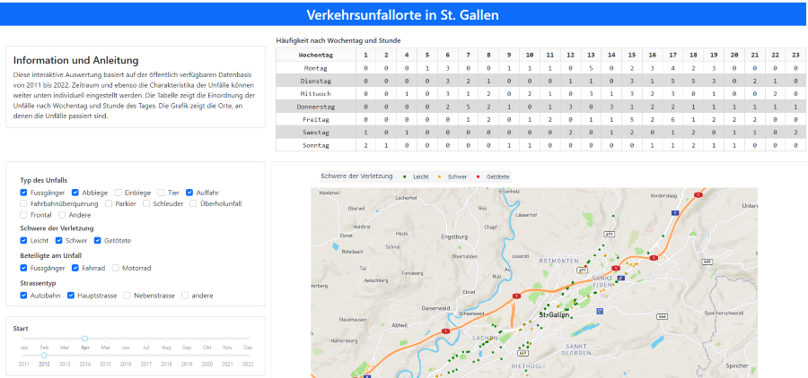

## Unfallorte in St. Gallen

### App

Diese App basiert auf dem "Open-Source-Framework" Dash. 

---

### Dash

> [Dash](https://plot.ly/products/dash/) is a productive Python framework for building web applications.
Written on top of Flask, Plotly.js, and React.js, Dash is ideal for building data visualization apps with highly custom user interfaces in pure Python. It's particularly suited for anyone who works with data in Python.

---

### Datensatz: Belegung neu erstellter Wohnungen
[Datenquelle](https://daten.stadt.sg.ch/explore/dataset/belegung-neu-erstellter-wohnungen-2011-2019/information/?disjunctive.ewid&disjunctive.belegungsjahr&disjunctive.bauperiode&disjunctive.quartiersgruppe&disjunctive.quartiersgruppe_name&disjunctive.wohnungsgroesse&disjunctive.anz_kinder&disjunctive.anz_erwachsene&disjunctive.hh_typ&disjunctive.hh_typ_label&disjunctive.erstellungsjahr)
abcd

### Info des Herausgebers: (Fachstelle für Statistik Kanton St.Gallen)
XXX
